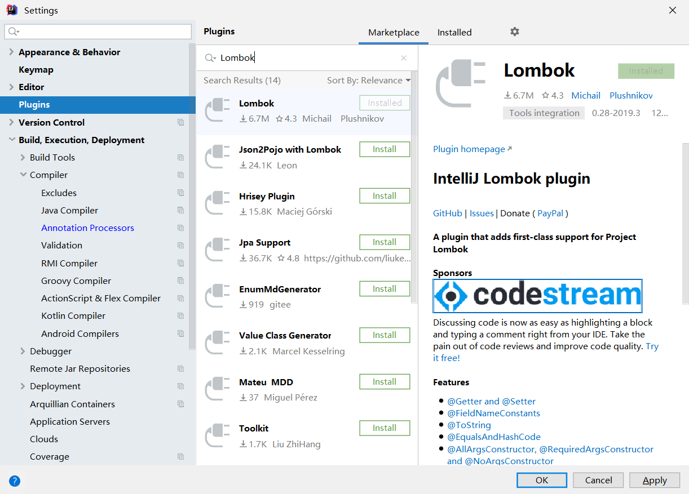
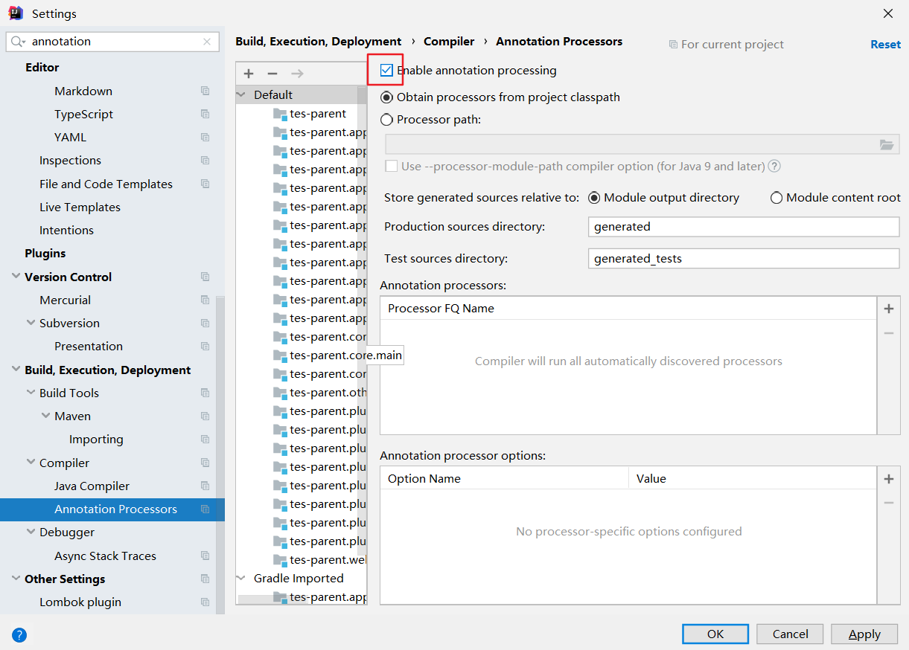

# 安装说明
- 依赖：
    - JDK8: https://www.runoob.com/w3cnote/windows10-java-setup.html
    - gradle: https://gradle.org
    - mongodb: https://www.mongodb.com
        - 默认即可
- 安装
    - 使用git或者直接下载代码
        - git clone https://github.com/Flappyboy/TES.git
        - https://codeload.github.com/Flappyboy/TES/zip/master
    - 由于使用了lombok，所以使用IDE时需要下载lombok插件,并开启annotation，以下以IntelliJ IDEA为例：
        - Files -> Settings -> plugins
        
        - Files -> Settings -> Build。。。 -> Compiler -> annotation processor
        

# 导入数据：
- 执行top.jach.tes.app.jhkt.DataMain.main，传入参数：数据所在的目录data
    - 数据的目录结构如下：
         - data
            - data_v20191220001
               - xxx_xxx.json
               - xxx_xxx.json
            - data_v20191221001
               - xxx_xxx.json
               - xxx_xxx.json
# 开发流程
- 下载代码、更新代码仓
    - git clone https://github.com/Flappyboy/TES.git
    - git pull
- 拉取自己的分支，分支名规则： 姓名的拼音/xxx
    - git checkout -b 姓名的拼音/xxx
- 提交自己的修改
    - git add .
    - git commit -m 'xxx'
    - git push -u origin
- 合并回master分支
    - 在github上发起 pull request