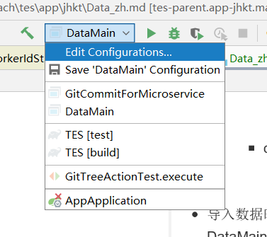
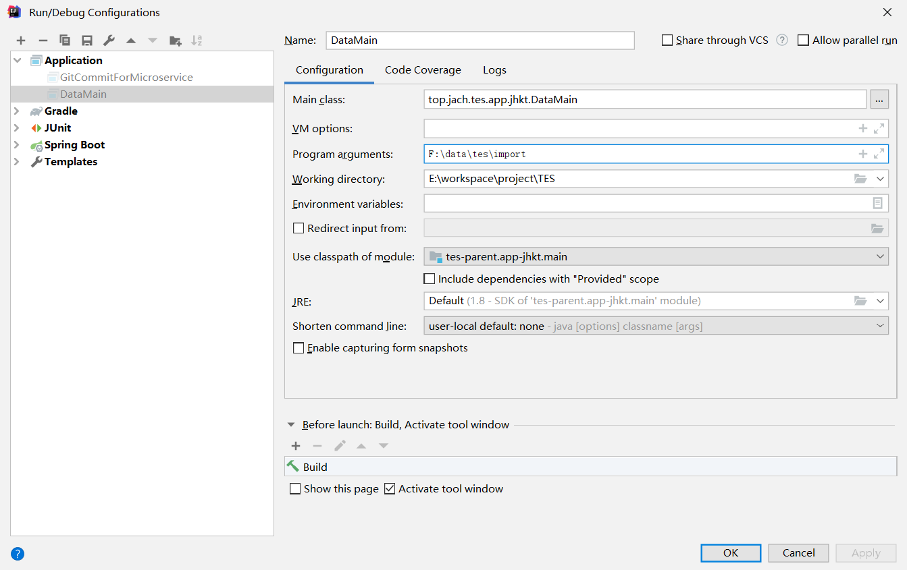
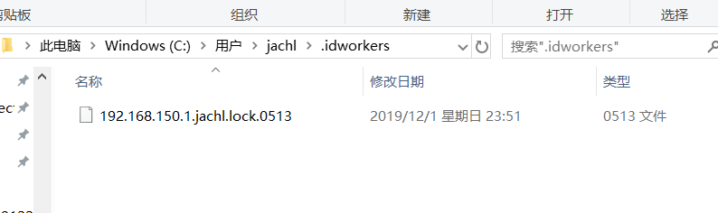

# 数据导入导出
- 导入导出数据都需要指定一个目录，目录及其文件的格式如下
    - data
        - data_v20191220001
            - xxx_xxx.json
            - xxx_xxx.json
        - data_v20191221001
            - xxx_xxx.json
            - xxx_xxx.json
- 导入数据时需要执行DataMain.main, 并加上一个目录路径的参数即可。Idea中指定参数的方法如下：

- 导入数据时若抛出异常: "RuntimeException:当前的IdWoker为：xxxx，与数据源IdWoker冲突，请修改用户目录下.idwokers/目录下文件名后四位......", 说明数据源的ID生成器和本地机器的ID生成器随机到了一个相同的值，需要手动进行修改。

